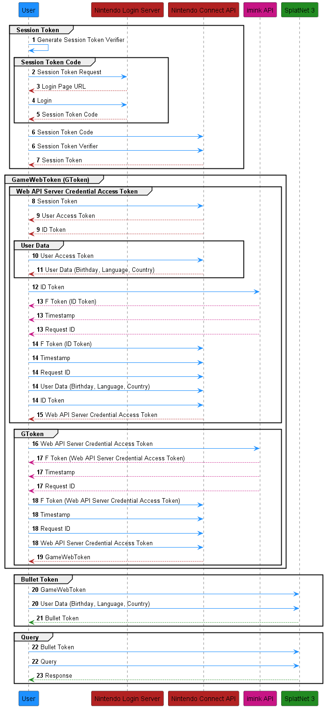

Nintendo Switch Online Login Flow
=================================

.. WARNING::

    This document is a work in progress and is not complete. It also contains
    my best attempt at explaining the login flow, but it may or may not be
    correct. If you find any errors or have any questions, please open an issue
    on the GitHub repository or feel free to open a pull request correcting the
    issue. 

    All of the information in this document is based on the information I have
    gathered thanks to the work of others. Mostly thanks to the work of
    `eli <https://github.com/frozenpandaman>`_, 
    `Samuel Thomas <https://github.com/samuelthomas2774>`_, 
    `Jone Wang <https://github.com/JoneWang>`_, 
    `Zeke Snyder <https://github.com/ZekeSnider>`_, among countless others I'm
    sure I've missed.

The Nintendo Switch Online login flow is a bit more complicated than most other
login flows, this is because Nintendo intentionally has obfuscated the process.

The overall login flow can be condensed into the following stages:

1. Obtaining a Session Token
2. Obtaining a GameWebToken (GToken)
3. Obtaining a Bullet Token
4. Making a query

Each stage must be completed before the next can be started, and each stage
consists of multiple steps of varying complexity. The following sections will
go into detail about each stage.

At a Glance
-----------
Credit goes to `Jone Wang <https://github.com/JoneWang>`_ and
`eli <https://github.com/frozenpandaman>`_ for their diagrams that helped me
understand the login flow and create this diagram.

Obtaining a Session Token
-------------------------

.. SEEALSO::

    This section is a recap of the :doc:`session_token` section but will go over
    what the steps are doing rather than teaching you how to do them.

The first stage of the login flow is to obtain a session token. This token is
used to authenticate the user to the Nintendo Switch Online servers. It is also
the only token that cannot be autogenerated by this library, and must be
obtained by the user and provided to the library when creating any of the
interfaces. The session token is obtained by logging in to the Nintendo Account
you wish to use with the Nintendo Switch Online service.

As the diagram above shows, the Nintendo Login Service is a seperate service
from the Nintendo Connect API. This means that in order to obtain a session
token after logging in, we must prove to the Nintendo Connect API that we are
who we say we are. This is done through a SHA256 code challenge. As such, the
first step in obtaining a session token is to generate a code challenge and
verifier pair. Once the code challenge and verifier pair is generated, the user
must be redirected to the Nintendo Login Service to log in. Once the user has
logged in, a URI will be provided to the user that has a code embedded in it.
This code is the ``session_token_code`` and is used to obtain the session token.
Once the session token code is obtained, it is used in conjunction with the code
verifier to obtain the session token from the Nintendo Connect API.

Obtaining a GameWebToken (GToken)
---------------------------------

The second stage of the login flow is to obtain a GameWebToken, better known as
a gtoken. This token is used to authenticate the user to the Nintendo Switch
Online servers and to obtain a bullet token, which is in turn used to
authenticate the user to the SplatNet 3 API. Obtaining the gtoken is the most
complicated part of the login flow, but can be broken down into two phases:

1. Obtaining a Web API Server Credential Access Token
2. Obtaining a GameWebToken

Before the user is able to obtain a gtoken, they must first obtain a Web API
Server Credential Access Token and some User Data associated with the account.
First, the session token is used to obtain a User Access Token and an ID Token 
from the Nintendo Connect API. This token is then used to obtain user data from
the Nintendo Connect API and contains several pieces of information, notably the
user's language, country, and birthdate.

In 2019, Nintendo made it more difficult for third party applications to obtain
a gtoken through the introduction of a HMAC code. This code is used to verify
that the user is connecting through the official Nintendo Switch Online app and
not a third party application, such as this library. The HMAC code is generated
through an obfuscated process that involves the ID Token, the timestamp, and the
request ID. The ID Token is sent to a third party server that is run by
``imink`` and returns the HMAC code, known as an "f" token, a timestamp, and a
request ID. The timestamp, request ID, "f" token, and ID token are then used to
obtain a Web API Server Credential Access Token from the Nintendo Connect API.
A second "f" token is then generated using the same process as before, but this
time the Web API Server Credential Access Token is used instead of the ID Token.
This second "f" token is then used to obtain a gtoken from the Nintendo Connect
API using the Web API Server Credential Access Token instead of the ID Token.

Obtaining a Bullet Token
------------------------

The third stage of the login flow is to obtain a bullet token. This token is
used to authenticate the user to the SplatNet 3 API. The bullet token is
obtained by using the gtoken and the user data obtained in the previous stage to
obtain a bullet token.

Making a Query
--------------

The fourth and final stage of the login flow is to make a query. This is the
stage where the user is able to make requests to the SplatNet 3 API. The
requests are made using the bullet token obtained in the previous stage.