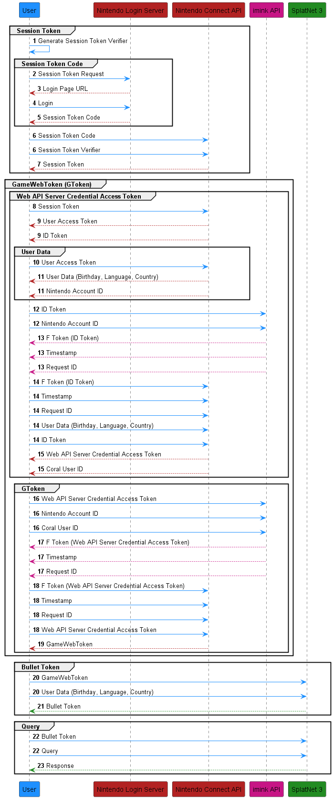

Nintendo Switch Online Login Flow
=================================

.. WARNING::

    This document is a work in progress and is not complete. It also contains
    my best attempt at explaining the login flow, but it may or may not be
    correct. If you find any errors or have any questions, please open an issue
    on the GitHub repository or feel free to open a pull request correcting the
    issue. 

    All of the information in this document is based on the information I have
    gathered thanks to the work of others. Mostly thanks to the work of
    `Eli Fessler <https://github.com/frozenpandaman>`_, 
    `Samuel Thomas <https://github.com/samuelthomas2774>`_, 
    `Jone Wang <https://github.com/JoneWang>`_, 
    `Zeke Snyder <https://github.com/ZekeSnider>`_, among countless others I'm
    sure I've missed.

The Nintendo Switch Online login flow is a bit more complicated than most other
login flows, this is because Nintendo intentionally has obfuscated the process.
This document will attempt to explain the login flow in as much detail as I can
without going into too much detail about the "how" of the login flow. This
document will also attempt to explain the login flow in a way that is easy for
anyone to understand, even if they have little prior knowledge about networking
and authentication processes.

The process to make a query to the SplatNet 3 API from scratch can be broken
down into four overarching stages:

1. Obtaining a Session Token
2. Obtaining a GameWebToken (GToken)
3. Obtaining a Bullet Token
4. Making a query

Each stage must be completed before the next can be started, and each stage
consists of multiple phases of varying complexity. The following sections will
go into detail about each stage.

At a Glance
-----------
Credit goes to `Jone <https://github.com/JoneWang>`_ and
`eli <https://github.com/frozenpandaman>`_ for their diagrams that helped me
understand the login flow and create this diagram.

Obtaining a Session Token
-------------------------

.. SEEALSO::

    This section is a recap of the :doc:`session_token` section but will go over
    what the steps are doing rather than teaching you how to do them.

The first stage of the login flow is to obtain a session token. This token is
used to authenticate the user to the Nintendo Switch Online servers. It is also
the only token that cannot be autogenerated by this library, and must be
obtained by the user and provided to the library when using any of the
interfaces provided. The session token is obtained by logging in to the Nintendo
Account you wish to use with the Nintendo Switch Online service.

As the diagram above shows, the Nintendo Login Service is a seperate service
from the Nintendo Connect API. This means that in order to obtain a session
token after logging in, we must prove to the Nintendo Connect API that we are
who we say we are. This is done through a SHA256 code challenge. As such, the
first step in obtaining a session token is to generate a code challenge and
verifier pair. Once the code challenge and verifier pair is generated, a URL is
generated using the code challenge that will prompt the user to log in to their
Nintendo Account. Once the user has logged in, a URI will be provided to the
user that has a code embedded in it. This code is the ``session_token_code`` and
is used to obtain the session token. Once the session token code is obtained, it
is used in conjunction with the code verifier to obtain the session token from
the Nintendo Connect API.

Obtaining a GameWebToken (GToken)
---------------------------------

The second stage of the login flow is to obtain a GameWebToken, better known as
a gtoken. This token is used to authenticate the user to the Nintendo Switch
Online servers and to obtain a bullet token, which will be expanded upon in the
next section. Obtaining the gtoken is the most complicated part of the login
flow, but can be broken down into two phases:

1. Obtaining a Web API Server Credential Access Token
2. Obtaining a GameWebToken

Before the user is able to obtain a gtoken, they must first obtain a Web API
Server Credential Access Token and some User Data associated with the account.
First, the session token is used to obtain a User Access Token and an ID Token 
from the Nintendo Connect API. This user access token is then used to obtain
user data from the Nintendo Connect API. The user data contains several pieces
of information, notably the user's language, country, and birthdate, which will
be used in a couple of steps later on to obtain different tokens.

In 2019, Nintendo made it more difficult for third party applications to obtain
a gtoken by introducing an `HMAC code <https://en.wikipedia.org/wiki/HMAC>`_.
The HMAC code is used to verify  that the user is connecting through the
official Nintendo Switch Online app and not a third party application, like this
library. The HMAC code is generated through an obfuscated process that involves
the ID Token, the timestamp, and the request ID. The ID token is sent to a third
party server that is run by ``imink`` and returns the HMAC code (known as an "f"
token), a timestamp, and a request ID. The ID token, user data, "f" token,
timestamp, and request ID are then sent to the Nintendo Connect API to obtain a
Web API Server Credential Access Token from the Nintendo Connect API. The Web
API Server Credential Access Token is then sent to ``imink`` to generate another
HMAC code, timestamp, and request ID. This time, the Web API Server Credential
Access Token is sent to ``imink`` instead of the ID token, which returns a new
"f" token, timestamp, and request ID. The Web API Server Credential Access
Token, "f" token, timestamp, and request ID are then sent to the Nintendo
Connect API to obtain a gtoken.

Obtaining a Bullet Token
------------------------

The third stage of the login flow is to obtain a bullet token. This token is
used to authenticate the user to the SplatNet 3 API. The bullet token is
obtained by using the gtoken and the user data obtained in the previous stage to
obtain a bullet token.

Making a Query
--------------

The fourth and final stage of the login flow is to make a query. This is the
stage where the user is able to make requests to the SplatNet 3 API. The
requests are made using the bullet token obtained in the previous stage.

That's it for the login flow! If you have any questions or find any errors, feel
free to open an issue on the GitHub repository or open a pull request correcting
the issue.