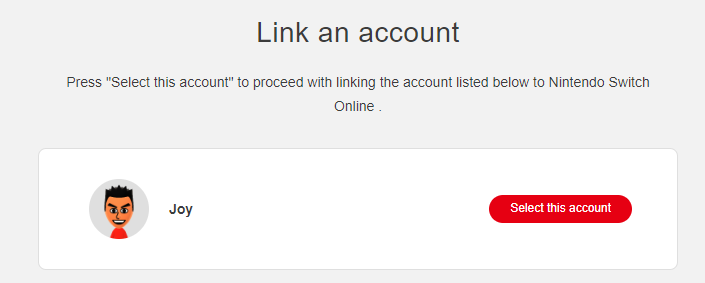

Obtaining A Session Token
=========================

To use this package, you must first obtain a valid Nintendo session token. This
requires a Nintendo Switch Online membership and having played at least one
online match in Splatoon 3. Neither the ``scraper`` module nor the ``query``
module currently provide any functionality for obtaining a session token, but
the ``auth`` module provides the functions necessary to do so through the
:class:`NSO` class. The following example shows the first step in obtaining
a session token, which is to obtain a login URL. Details of the login flow can
be found in the :doc:`login_flow` page.

.. code-block:: python

    from splatnet3_scraper.auth import NSO

    nso = NSO.new_instance()
    print(nso.generate_login_url())

.. attention::
    It is extremely important that you use the same instance of the ``NSO``
    class throughout the login flow. If you create a new instance, you will
    not be able to obtain a session token. This is because the ``NSO`` class
    stores variables internally that are required to verify to Nintendo that
    you are the same person who requested the login URL. If you create a new
    instance, you will be treated as a new person and will be unable to
    obtain a session token.

The above code will print a very long URL to the console. Copy this URL and
paste it into your browser. You will be redirected to a Nintendo login page.
Enter your Nintendo Switch Online credentials and you will be redirected to a
page that looks like this:

Right-click on the red "Select this account" button and select "Copy link
address". You may click the button if you wish, but it will not work as the URL
begins with ``npf``. With the copied URL in hand, you can now obtain a session
token. Use the following code to do so:

.. code-block:: python

    copied_url = ...
    session_token_code = nso.parse_npf_uri(copied_url)
    session_token = nso.get_session_token(session_token_code)

The ``copied_url`` variable should be replaced with the URL you copied from the
browser. The ``session_token_code`` variable will contain the code that is
required to obtain the session token. The ``session_token`` variable will
contain the session token itself, as a string. You can now use this session
token to make requests to the Splatoon 3 API.

.. warning::
    The session token is valid for two whole years. You functionally will not
    need to obtain a new session token unless you lose the one you have,
    Nintendo changes the session token format, or the session token expires, in
    order of descending likelihood. Make absolutely sure that you do not share
    your session token with anyone else. If you do, they will have access to
    your Nintendo Switch Online account and will be able to make requests on
    your behalf. If you are concerned about your session token being leaked,
    you can revoke it.
